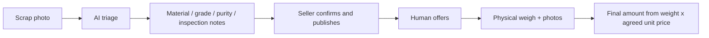
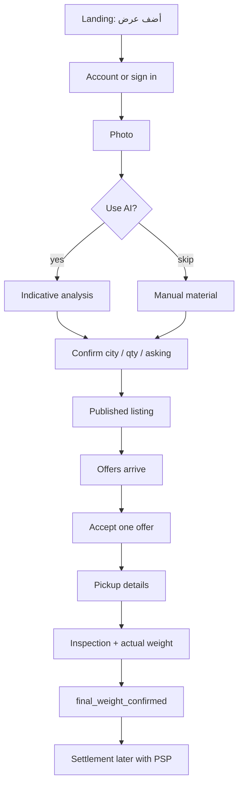
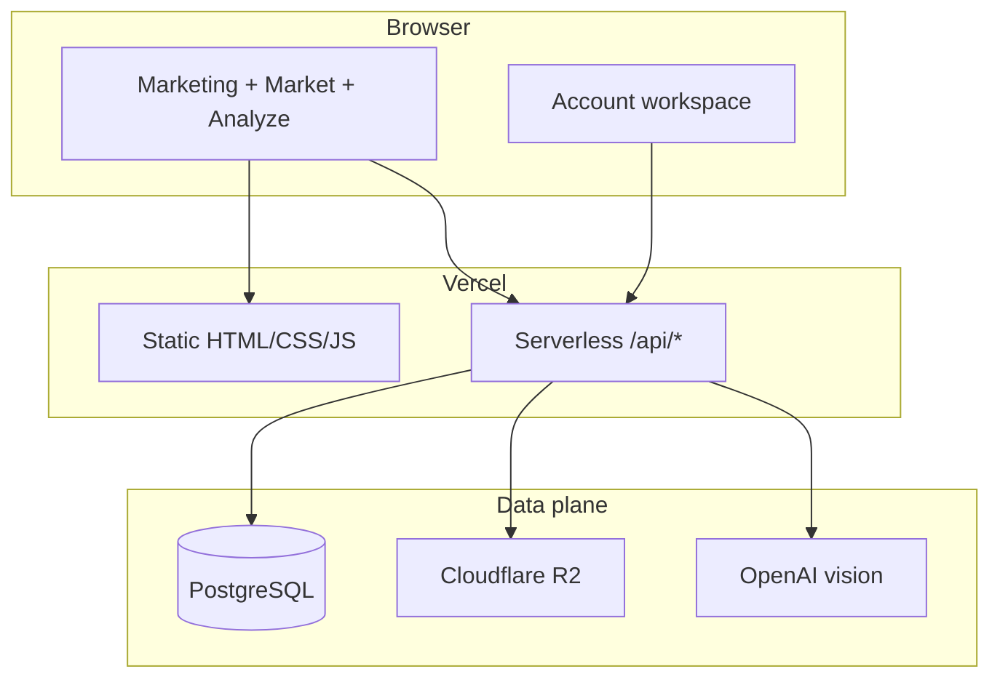

# Scrap AI — Locked Architecture

**Status: LOCKED** as of 2026-09-05.  
Do not reopen stack, domain model, AI boundary, or information architecture unless a licensed payment provider or a legal requirement forces it.

Delivery path: **local → GitHub → Vercel**. Runtime truth is `GET /api/health` on production.

---

## 1. Business we are building

Scrap AI is a **Saudi-first bilingual marketplace** that connects people and companies who have scrap with buyers (yards, factories, recyclers).

It is **not** a certified laboratory, **not** a bank, and **not** our own nationwide pickup fleet.

### Who it is for

| Person | Job to be done | Success |
| --- | --- | --- |
| Seller (individual or company) | Turn scrap into a deal without WhatsApp chaos | List in minutes, receive offers, close with evidence |
| Buyer (yard / factory / trader) | Find lots in Saudi cities and bid | Browse, offer, inspect weight, complete pickup |
| Platform | Trust + conversion | Verified orgs, AI-assisted listing quality, documented deals |

### Commercial model (v1)

- Free to list and to offer.
- Revenue later: transaction commission, verified-buyer subscription, optional pickup-coordination fee. **Not implemented until deals are real.**

### Honest limits (always on the product)

No certified grading, no live LME price as a binding quote, no ownership legal check, no escrow until a licensed Saudi PSP is connected.

---

## 2. What we copy from the market (fit, not clone)

We start from where the best products already ended, then keep only what works for Saudi clients and sales.

| Source | What they do well | What we take | What we do **not** copy now |
| --- | --- | --- | --- |
| **The Kabadiwala** | 3 steps, big category cards, photo/location, digital weigh, simple Arabic-equivalent CTA | Simplicity: photo → list → deal. Large actions. Trust via weight evidence | Own collector fleet, instant cash/UPI, rate-list as live prices, rewards |
| **Doum (SA)** | List → offers → choose offer. Category tiles. Arabic/English. Saudi cities | Core marketplace loop. Category-first marketing. Bilingual RTL | Claiming free pickup / guaranteed payment before we operate them |
| **ScrapAd** | Photo lots, verify companies, negotiate, milestone logistics | Listing cards with photo + qty + city. Verified org badge. Offer/negotiate | Incoterms, FX hedge, global escrow, door-to-door international logistics |
| **Recykal** | Traceability dashboard | Stage timeline + documents on the deal | GST/EPR India compliance, pan-India network |

**Saudi product sentence (marketing):**  
البائع يعرض → المشتري يقدّم عرض → AI يساعد في التحليل والتوثيق → الفحص والوزن → الاستلام.

---

## 3. Locked product boundary

### In v1 (mandatory)

1. Arabic-first / English toggle, RTL-safe, mobile-first.
2. One account can sell and buy (mode switch, not two products).
3. Public **live** marketplace (real listings, not demo cards).
4. Photo-first listing; AI analysis optional but first-class.
5. Buyer offer → seller accept **one** offer → pickup schedule.
6. Transaction stages through **final_weight_confirmed**.
7. Org verification submit (manual review).
8. Private evidence upload when R2 is configured.
9. Indicative AI image analysis when OpenAI is configured.
10. Health endpoint, signed sessions, PostgreSQL durability.

### Out until a later phase (do not build)

- Own pickup fleet, driver app, live map tracking  
- Instant wallet / cash / STC Pay / escrow  
- Live LME or “official” SAR/kg ticker as a quote  
- Auctions, RFQ, sealed bids, recurring contracts  
- Global B2B, Incoterms, ports, export lots  
- Guest “book a collector now” like Kabadiwala  
- Price alerts as a product feature  
- Multi-user RBAC beyond owner  
- Passwordless / OTP until an SMS/email provider is chosen  

---

## 4. How AI assists (locked)

AI is a **deal assistant**, never the marketplace and never a certificate.

| Moment | AI does | Human / system does |
| --- | --- | --- |
| Before listing | Classify photo, suggest material, contamination flags, inspection checklist | Seller confirms city, qty, asking price |
| On listing | Store analysis id + image hash | Listing remains seller-owned |
| During deal | Compare inspection notes vs original AI flags (later) | Weighbridge / actual kg is source of price |
| Never | Certify identity, purity, ownership, or bind a price | — |

Guest may see a local indicative demo. **Logged-in** analysis hits OpenAI and is stored in `ai_analyses`.

---

## 5. Locked user journeys

### Seller (primary conversion)

### Buyer

Browse live lots → filter city/material → offer SAR → wait accept → join inspection → confirm weight.

---

## 6. Locked system architecture

Keep the current production stack. Do **not** rewrite to a new framework in v1.

| Layer | Choice | Why locked |
| --- | --- | --- |
| Hosting | Vercel | Already live; git push deploys |
| UI | Static bilingual client | Fast, SEO landing, no extra build |
| API | Vercel serverless `api/*.js` | Matches hosting |
| DB | PostgreSQL via `DATABASE_URL` | Durable orgs, listings, deals |
| Auth | Signed HttpOnly cookie (`SESSION_SECRET` ≥ 32) | Simple, no extra IdP |
| Files | R2 presign PUT | Private evidence, not public CDN yet |
| AI | OpenAI Responses + json schema | Indicative only |

### API map (stable contracts)

| Route | Auth | Responsibility |
| --- | --- | --- |
| `GET /api/health` | no | DB / session / AI / storage readiness |
| `GET/POST /api/auth` | mixed | register, login, logout, current user |
| `GET /api/listings` | no | **Public** open listings for the market page |
| `GET/POST /api/workflow` | session | create listing, offer, accept, my deals |
| `GET/POST /api/platform` | session | verification, transaction stages, disputes, payments **records** |
| `POST /api/ai-analyze` | session | image analysis |
| `POST /api/upload` | session | R2 presign + complete |

### Domain model (stable)

`organizations` 1—n `users` via `memberships`  
`organizations` 1—n `scrap_listings`  
`scrap_listings` 1—n `offers` → at most **one accepted**  
accepted `offer` → `pickups` → `scrap_transactions`  
`organization_verifications`, `organization_documents`, `ai_analyses`, `payment_records`, `disputes`

Transaction stages (unchanged):

`inspection_scheduled` → `inspected` → `final_weight_confirmed` → `pickup_scheduled` → `collected` → `settlement_pending` → `settled` → `closed`

`settled` / `closed` require licensed PSP + verified payment callback.

---

## 7. Locked UX / design system (do not restyle every sprint)

Inspired by Kabadiwala + Doum, original Scrap AI brand.

- **Look:** bright marketplace, white canvas, forest green CTAs (`#0f6f57`), large type, category tiles, photo cards.
- **IA:** Home · Market · Analyze · Account. No hidden second dashboard as the real product.
- **Home:** one promise, two CTAs (sell / browse), 3–4 steps, category strip.
- **Market:** live listings grid (photo, material, city, qty, asking or “negotiate”).
- **Analyze:** photo drop → result → “publish as listing”.
- **Account:** in-page workspace (buy / sell tabs), not a marketing-only overlay long term.
- **Voice:** short Arabic, money and trust, no fake live prices.

Visual language may refine tokens, not the IA or the journeys above.

---

## 8. Implementation phases

### Phase 0 — Foundation (current)

Schema in Git, env template, ensure-schema on APIs, one-offer integrity, public listings API. No visual redesign.

### Phase 1 — One product surface

Market page reads `/api/listings`. Listing is photo-first. Account workspace is the real sell/buy UI. Configure OpenAI + R2 in Vercel.

### Phase 2 — Trust

Verification review, evidence on deals, email/WhatsApp notify (when provider exists), password reset.

### Phase 3 — Payments

Licensed PSP only. Then `settled`.

### Phase 4 — Extend (explicitly later)

Fleet pickup, live prices, auctions, global B2B, multi-role orgs.

---

## 9. Source of truth

1. This file = architecture.  
2. `db/migrations/` = schema.  
3. GitHub `main` (or the agreed working branch) = code.  
4. `https://scrap-ai.vercel.app/api/health` = runtime.  
5. Historical QA under `docs/*QA*` = dated evidence only.
