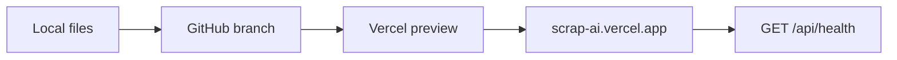
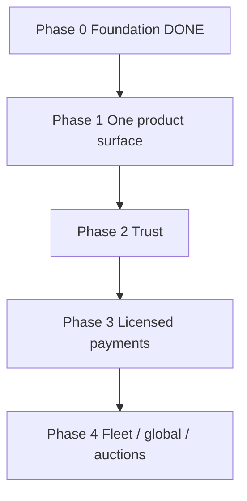

# Scrap AI — Implementation plan

Follows the locked architecture in [`ARCHITECTURE.md`](ARCHITECTURE.md).  
Do not change stack, journeys, or AI boundary here. This file is only **what we build, in what order**.

Delivery: **local (`npm run serve`) → GitHub → Vercel**.



---

## Why this product (business)

Saudi scrap today is WhatsApp, phone buyers, and informal weighing. International winners already solved the UX:

| We copy (fit KSA) | We refuse until later |
| --- | --- |
| Kabadiwala: 3 steps, photo/category, huge CTA | Their own fleet + instant cash |
| Doum: list → offers → accept | Fake “free pickup / guaranteed pay” |
| ScrapAd: photo lot + verified company | Incoterms, global escrow |
| Recykal: deal timeline + documents | India GST/EPR |

**Marketing sentence:** صوّر السكراب، انشر العرض، استقبل عروض الشراء، وثّق الوزن.

AI is the wedge versus a normal classifieds site: faster listing quality, inspection notes, not a fake live price.

---

## Mandatory vs later

**In boundary (v1):** bilingual market, live listings, photo-first list, optional AI, one accepted offer, pickup, inspect to `final_weight_confirmed`, verification submit, R2 when configured.

**Out of boundary:** fleet app, wallet/PSP, live commodity ticker, auctions, export lots, OTP, price-alert product.

---

## Phases



| Phase | Outcome | Status |
| --- | --- | --- |
| 0 Foundation | Schema in Git, env template, listing validation, one-offer lock, public `/api/listings` | Done |
| 1 One surface | Photo-first sell, analyze → publish, live market page, no “demo market” | In progress |
| 2 Trust | Review verification, evidence on deal, notify | Not started |
| 3 Payments | Licensed PSP webhooks then `settled` | Blocked on provider |
| 4 Extend | Fleet, live rates, auctions, global B2B | Explicitly later |

---

## Phase 1 task list (current)

1. Photo-first listing form — done
2. Analyze page writes a listing draft → account sell tab — done
3. In-page Account workspace (not a floating overlay) — done
4. Public market on `/api/listings` — done
5. Listing photo upload via R2 when configured; public read via `/api/media` — done (needs R2 env)
6. Local migrate script — done

---

## How to run

```powershell
npm install
npm test
npm run serve
```

With a database:

```powershell
$env:DATABASE_URL="..."
$env:SESSION_SECRET="................................"
npm run migrate
```

Push the working branch; Vercel deploys. Confirm `https://scrap-ai.vercel.app/api/health`.
